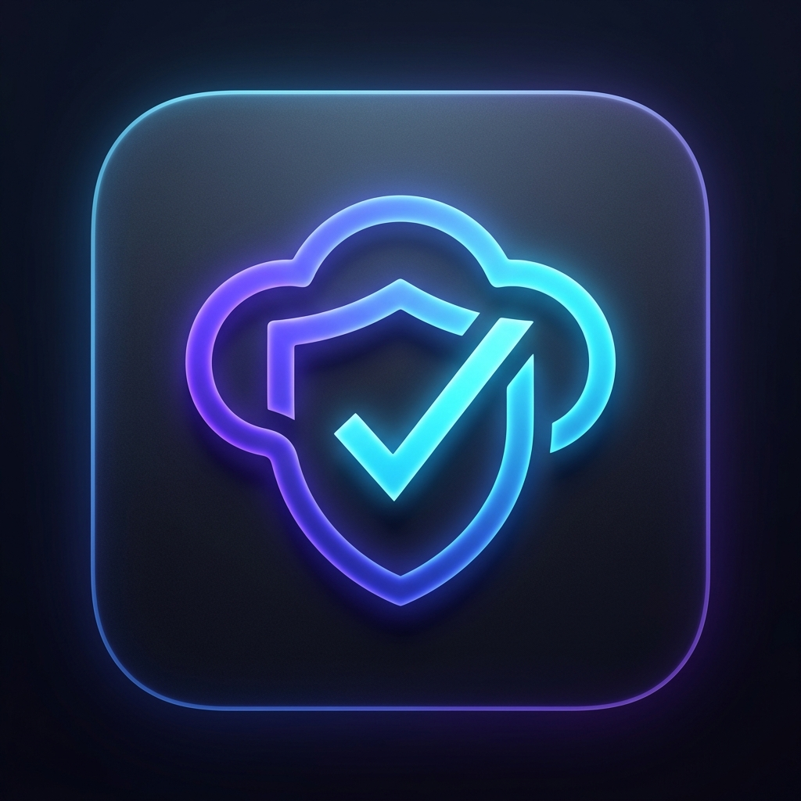
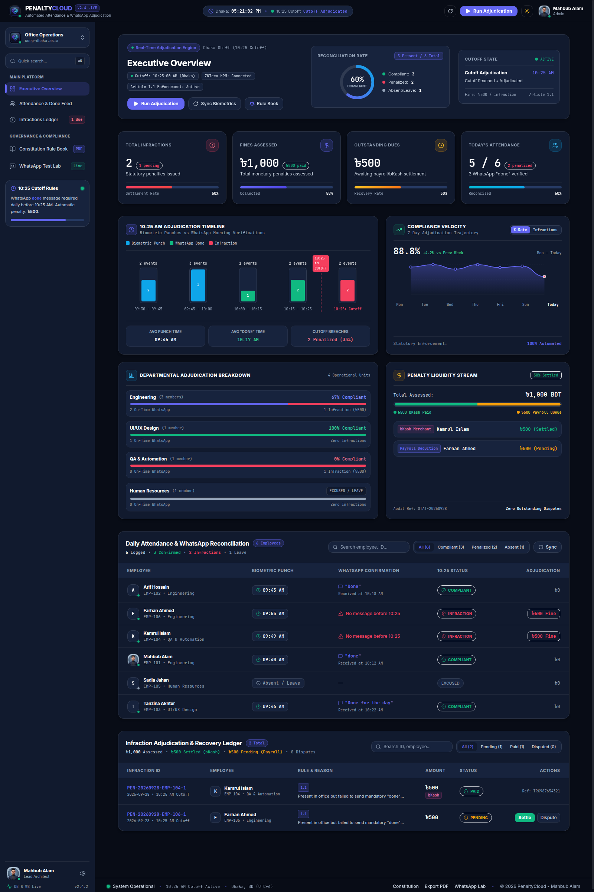
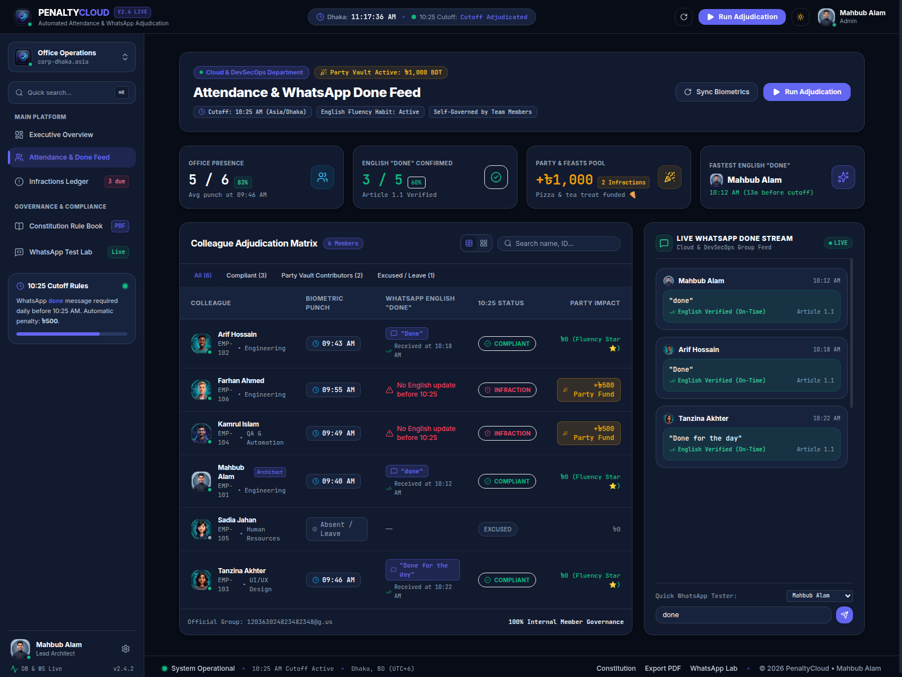
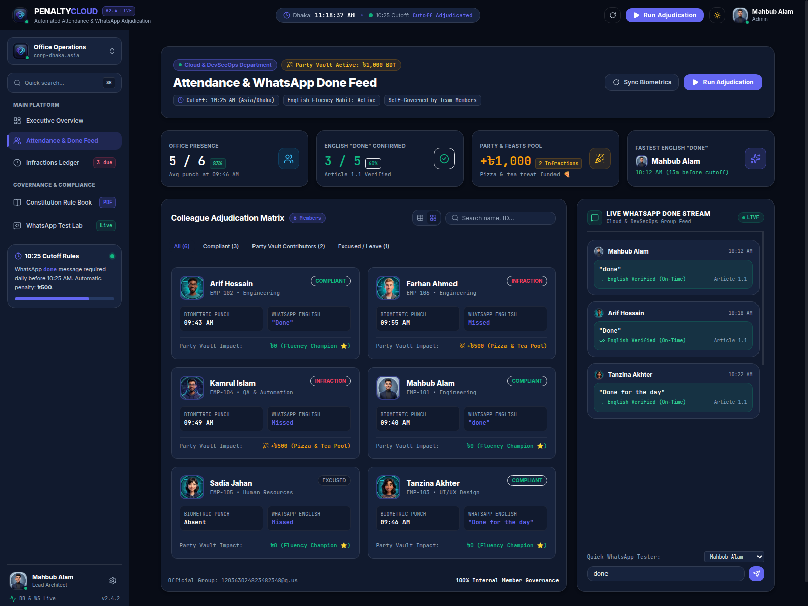
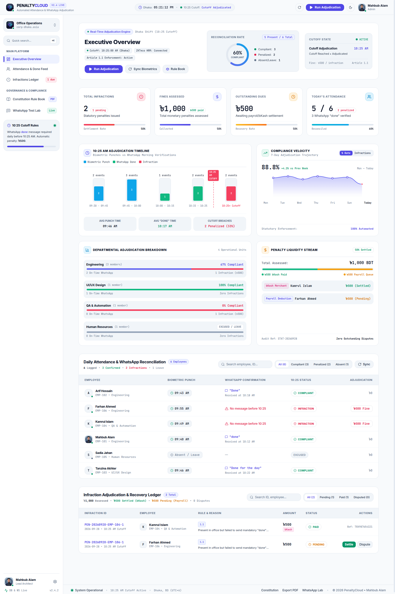
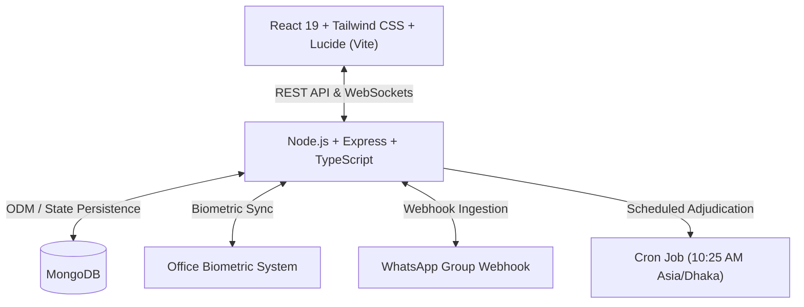

# ⚡ PENALTYCLOUD

<p align="center">
  
</p>

<p align="center">
  <strong>Automated English-Fluency & WhatsApp Morning Check-In Adjudication Platform</strong>
  <br />
  <em>A friendly, self-governed initiative by the Cloud & DevSecOps Department to boost English communication & fund team parties! ☕🎉</em>
</p>

<p align="center">
  
  
  
  
</p>

---

## 🎯 The Purpose & Philosophy: Why We Built This

> 💡 **TL;DR:** This is **NOT** an official office rule, and it has **NOTHING to do with HR**.  
> This platform is 100% created and maintained internally by the **Cloud & DevSecOps Department** for **fun, team bonding, English habit-building, and funding great team feasts!**

### 1. English Fluency Habit Building
In the tech and cloud world, expressing ideas clearly and fluently in English is a superpower. Every morning when colleagues arrive at the office, everyone sends a short check-in message in our official WhatsApp group:
* `"done"`
* `"done for the day"`
* `"checked in and ready for sprint planning"`
* Any conversational morning update in English!

This simple habit ensures everyone starts the day communicating in English and breaking out of their comfort zone with confidence.

### 2. The 10:25 AM Cutoff Rule (Article 1.1)
* **The Rule:** If you are physically present in the office, you must post your English confirmation message in WhatsApp **before 10:25:00 AM (Dhaka Time)**.
* **The Penalty:** If you forget or post after 10:25 AM, the automated adjudication engine logs a **৳500 statutory contribution**.

### 3. The Party Vault 🎉🍕
**Where does the penalty money go?**  
Every single Taka collected goes straight into the **Team Fun & Party Vault**!
* 🍕 Pizza & Biryani office feasts
* ☕ Evening snacks, tea, and sweet treats
* 🎮 Team hangout sessions and celebrations

Missed your 10:25 AM message? You just bought the team their next round of snacks! 🥳

---

## 📸 System Previews

### 🌙 Executive Data Visualizer (Luminous Dark Mode)


### 💬 Live Attendance & WhatsApp "Done" Feed (Dense Split View)


### 🎴 Colleague Member Cards (Interactive Grid View)


### ☀️ Executive Data Visualizer (Crisp Light Mode)


---

## 🚀 Key Features

* **⏱️ Real-Time 10:25 AM Asia/Dhaka Countdown:**  
  Live countdown timer and automated cron schedule running at exactly 10:25:00 AM every business day.
* **📊 High-Density Data Visualizer:**
  * **10:25 AM Adjudication Timeline (Histogram):** Time-bucketed distribution showing biometric check-ins vs on-time WhatsApp confirmations vs cutoff breaches.
  * **Compliance Velocity Curve (7D Spline):** Interactive smooth Bezier spline graph displaying historical adherence trajectory and weekly comparisons.
  * **Departmental Risk Breakdown:** Visual progress tracks for Engineering, QA, Design, and HR units.
  * **Penalty Liquidity & Settlement Stream:** Multi-segment flow ribbon tracking assessed vs collected funds (bKash instant merchant settlement & payroll friendly queue).
* **🤝 WhatsApp & Biometric Reconciliation:**  
  Reconciles biometric finger-punch timestamps from the office HRM with incoming messages from the official WhatsApp group.
* **⚡ Live WebSockets (Socket.IO):**  
  Real-time push notifications when adjudication runs, when someone settles via bKash, or when a message is verified.
* **⚖️ Dispute & Exception Handling:**  
  Colleagues with official client meetings, doctor appointments, or pre-approved leave can submit formal waivers with zero friction.
* **📜 Constitution Rule Book & PDF Exporter:**  
  View all team articles, grace periods, and severity levels with one-click branded PDF generation.
* **🧪 Interactive WhatsApp Test Lab:**  
  Simulate morning WhatsApp messages directly inside the UI to test the natural language confirmation engine.

---

## 🛠️ Architecture & Tech Stack



| Layer | Technologies |
|---|---|
| **Frontend** | React 19, TypeScript, Vite, Tailwind CSS, Lucide Icons, Canvas Confetti |
| **Backend** | Node.js, Express, TypeScript, Socket.IO, node-cron, PDFKit |
| **Database** | MongoDB (Mongoose ODM) |
| **Integrations** | WhatsApp Webhook Simulator, Biometric Punch Feed, bKash Merchant Gateway |

---

## 📦 Installation & Setup Guide

### Prerequisites
Make sure you have the following installed on your machine:
* **Node.js** (v18.0.0 or higher) & **npm**
* **MongoDB** (running locally on `mongodb://localhost:27017` or a MongoDB Atlas URI)
* **Git**

---

### 1. Clone the Repository
```bash
git clone https://github.com/your-username/penalty-cloud.git
cd penalty-cloud
```

---

### 2. Configure Backend Server

```bash
cd server
npm install
```

Create a `.env` file inside the `server/` directory:
```env
PORT=5000
MONGODB_URI=mongodb://localhost:27017/penaltycloud
NODE_ENV=development
CLIENT_URL=http://localhost:5173
CUTOFF_TIME=10:25
TIMEZONE=Asia/Dhaka
DEFAULT_FINE_AMOUNT=500
```

Seed the initial Constitution rules and demo team records:
```bash
npm run seed
```

Start the backend development server:
```bash
npm run dev
```
The server will start on `http://localhost:5000`.

---

### 3. Configure Frontend Client

Open a new terminal window:
```bash
cd client
npm install
```

Start the Vite development server:
```bash
npm run dev
```
The client will start on `http://localhost:5173`.

---

## 📖 How It Works in Daily Practice

```
 09:30 AM  ── Biometric Check-In (Colleague punches in at office)
               │
 09:30 - 10:24 AM  ── English Confirmation Window
               │      Colleague opens WhatsApp group and writes: "done"
               │
 10:25:00 AM ── [CRITICAL CUTOFF THRESHOLD]
               ├── Present + Message Sent  --> ✅ COMPLIANT (৳0 Fine)
               ├── Present + No Message    --> ❌ INFRACTION TRIGGERED (৳500 to Party Fund)
               └── On Leave / Excused      --> 💤 EXCUSED (৳0 Fine)
```

---

## 👥 The Team

This system was ideated, engineered, and governed by members of the **Cloud & DevSecOps Department**:

* **Mahbub Alam** — *Lead Architect & Cloud/DevSecOps Engineer*
* Teammates across Engineering, QA, and Design who love English fluency, clean code, and delicious team parties!

---

## 📄 License
This project is licensed under the MIT License — feel free to fork and run your own team fluency & party fund engine!
